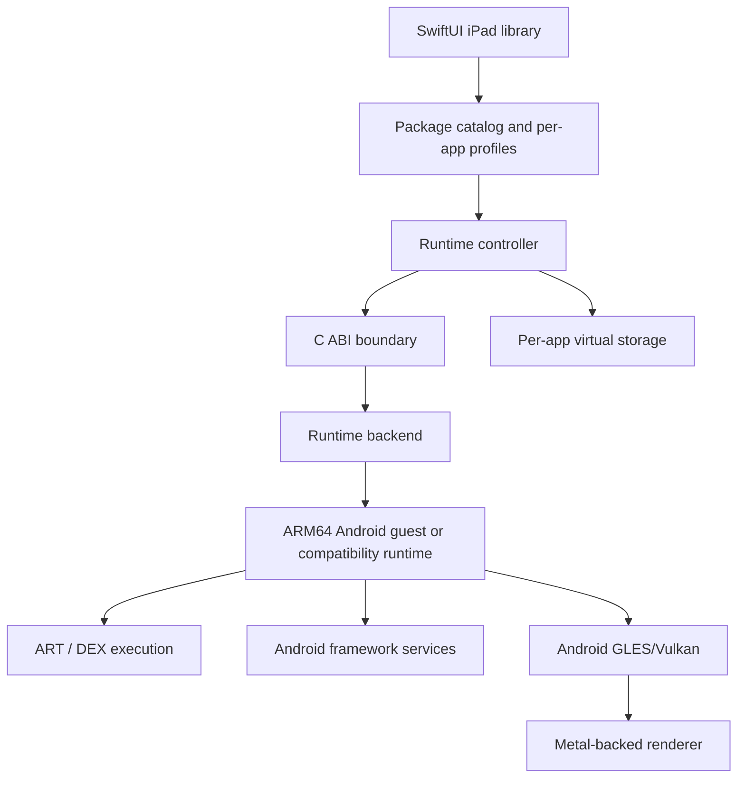

# Multi-APK iPadOS Emulator Architecture

## Goal

Provide one iPadOS application that maintains a library of legally obtained Android APKs and launches them through a shared Android-compatible runtime. The application shell is not an APK converter. It is a profile manager and display/input host for a future Android runtime backend.

## UTM-informed layers

UTM demonstrates the value of a thin native platform layer over a portable emulator core. This project follows that separation, but the Android guest is a distinct engineering problem from the QEMU VM lifecycle.

## Backend options

| Backend | Compatibility | Performance | Complexity | Recommendation |
| --- | --- | --- | --- | --- |
| Full ARM64 system emulation | Highest potential for arbitrary APKs | Lowest without acceleration | Very high | Long-term compatibility path |
| ARM64 virtualization | High if a suitable Android guest and entitlement are available | Highest | High and platform-constrained | Optional external integration only |
| User-space compatibility layer | Narrow and app-dependent | Potentially high for supported apps | Very high API-coverage burden | Not the first implementation |
| Interpreter-only guest | Same guest semantics, slower | Lowest | Moderate | First bootable validation target |

The first real milestone should be a minimal ARM64 Android guest that can boot and run an open-source test APK. Only after that should the library claim APK execution support.

## Multi-app model

Each imported APK receives a stable identifier, a catalog entry, an APK copy in the app’s private storage, an isolated virtual data directory, and an independent runtime profile. The initial shell stops the currently active profile before launching another. A later version can add save states and background suspension if the runtime supports them.

The app library should not assume that an APK’s filename is its package name. A real installer must parse the Android manifest and package signing metadata inside the APK, then use the Android package manager to install the package in the guest. The current shell uses a deterministic local placeholder name only so the UI can be exercised before the guest backend exists.

## Performance controls

The profile model exposes memory request, CPU thread count, resolution scale, frame-rate limit, graphics backend, and execution mode. These are requests, not entitlement changes. The native backend must clamp them to actual device and iPadOS limits and report the applied values back to the UI.

Recommended M1 optimizations include ARM64 guest images, avoiding host/guest ABI translation where possible, batched display updates, a Metal-native presentation path, asynchronous I/O, per-app cache directories, shader/pipeline caching, and an interpreter fallback. Performance must be measured with frame time, guest CPU utilization, memory pressure, thermal state, and crash rate rather than estimated from the host machine.

## Compatibility risks

Apps may fail because they require Google Play Services, SafetyNet or Play Integrity, DRM, proprietary native libraries, unsupported CPU ABIs, Vulkan extensions, special sensors, background services, online servers, or Android APIs not present in the guest image. A discontinued app can also depend on backend services that no longer exist. The launcher should show a compatibility report instead of promising universal support.

## Security and distribution boundary

The scaffold does not alter entitlements, generate executable pages, bypass code signing, escape the iPadOS sandbox, or modify other apps. A developer-signed build may expose an accelerated mode only when the user’s own signed runtime environment supplies the required capability. App Store distribution and sideloaded research builds are separate targets and require separate review of Apple’s current rules.
